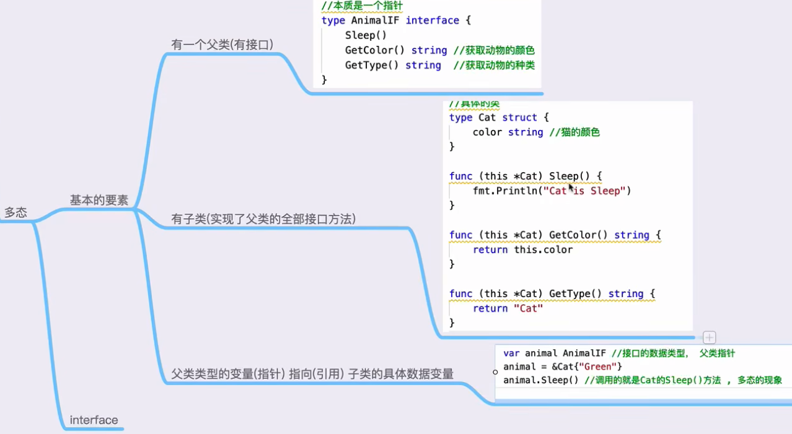
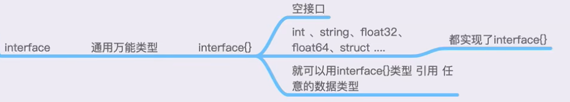

- 封装（Encapsulation）: Go 通过使用结构体（structs）实现封装。在 Go 中，你可以将数据（属性）和作用于这些数据的方法组合在一起，形成一个结构体。你可以使用大写字母开头的变量和方法来控制外部包的访问权限，这是 Go 中的公开（public）访问；如果使用小写字母开头，则为包内私有（private）访问。

- 继承（Inheritance）: Go 语言没有像传统面向对象语言中的类继承机制。相反，Go 使用嵌套（embedding）的方式来实现类似继承的功能。你可以在一个结构体中嵌入另一个结构体或接口，从而使外部结构体继承（或更准确地说，复用）内部结构体的字段和方法。这种方式提供了一种方法重用的机制，但并不支持传统的层级继承。

- 多态（Polymorphism）: Go 通过接口（interfaces）实现多态。接口定义了一组方法签名，但不实现这些方法。任何实现了这些方法的类型都被认为实现了该接口。这使得你可以编写灵活的函数和类型，它们可以接受任何满足接口的类型，从而实现方法的多种实现方式。这种方式允许不同类型的对象被视为同一类型的对象，从而实现了多态性。


在 Go 语言中，类型断言不仅限于 `interface{}` 这种空接口，它可以应用于任何接口类型。类型断言是一种用于提取或验证接口值的具体类型的操作，这一操作对所有接口类型都是有效的。这允许你从一个具有较少方法（或没有方法，如 `interface{}`）的接口变量中提取一个具体的类型，或者断言该接口变量是否实现了另一个具有更多方法的接口。

### 类型断言的基本语法

类型断言的基本形式如下：

```go
t := i.(T)
```

其中：
- `i` 是接口类型的变量。
- `T` 是你希望断言的目标类型，可以是具体类型或另一个接口类型。
- `t` 是结果，它将是类型 `T`。

如果断言成功，`t` 将是 `i` 的具体类型 `T` 的值。如果断言失败，程序会触发 panic（除非使用了另一种形式的类型断言，即带检查的类型断言）。

### 带检查的类型断言

你也可以用一种安全的方式进行类型断言，这种方式不会在断言失败时引起 panic：

```go
t, ok := i.(T)
```

这里：
- 如果 `i` 实现了类型 `T`，`t` 将是 `i` 的值，`ok` 将是 `true`。
- 如果 `i` 没有实现类型 `T`，`t` 将是类型 `T` 的零值，`ok` 将是 `false`。

这种方式特别有用，因为它提供了一种处理可能的类型不匹配的安全方式。

### 示例

假设有如下接口和结构体：

```go
type Reader interface {
    Read(p []byte) (n int, err error)
}

type Writer interface {
    Write(p []byte) (n int, err error)
}

type ReadWriter interface {
    Reader
    Writer
}

type MyFile struct{}

func (f *MyFile) Read(p []byte) (n int, err error) {
    // 实现细节
    return
}

func (f *MyFile) Write(p []byte) (n int, err error) {
    // 实现细节
    return
}
```

如果有一个 `Reader` 接口类型的变量，并且你知道它实际上也可能实现了 `Writer` 接口（例如，它可能是 `*MyFile`），你可以这样进行类型断言：

```go
var r Reader = &MyFile{}

// 尝试将 r 断言为 Writer
if w, ok := r.(Writer); ok {
    // 使用 w 的 Write 方法
    w.Write([]byte("hello"))
} else {
    fmt.Println("The value does not implement Writer")
}
```

这样，你就可以安全地检查并使用不同接口的功能。类型断言提供了一种灵活的方式来利用接口在 Go 中的动态特性，使得代码可以根据上下文环境来适应不同的需求。