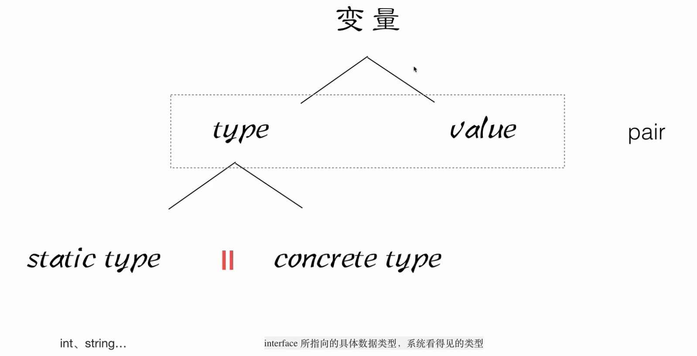

  
## 1
在 Go 语言中，关于类型系统的理解有几个重要的概念，其中包括静态类型（static type）和具体类型（concrete type）。下面详细解释这两个类型包含的内容：

### 静态类型（Static Type）

静态类型是变量在编译时被赋予的类型。这个类型决定了变量在程序中的存储需求和操作方式，也规定了变量可以执行哪些操作。在 Go 语言中，每个变量都有一个静态类型，这个类型在编译时是已知的，并且在变量的整个生命周期中不会改变。例如：

- 基本数据类型：`int`, `float64`, `bool` 等。
- 复合类型：如 `struct`, `array`, `slice`, `map`, `channel` 等。
- 接口类型：`interface{}` 或其他自定义接口类型。

### 具体类型（Concrete Type）

具体类型是静态类型的一个子集，它指的是实现了某个接口的类型。具体类型是实际存储值的类型，而接口类型本身不会存储任何具体的值，只定义了一组方法签名。当一个具体类型的实例被赋值给一个接口类型的变量时，该变量的具体类型就是那个实例的类型。具体类型包括所有非接口的类型，这些类型实现了零个或多个接口。例如：

- 所有的非接口类型，比如 `int`, `string`, `MyStruct`（自定义结构体）等，都可以视为具体类型。
- 具体类型不仅仅限于基本数据类型或结构体，任何实现了接口方法的类型（包括内置类型、用户自定义类型、甚至函数类型，只要它们满足接口的方法要求）都是具体类型。

### 在接口中的应用

在 Go 中，当一个接口类型的变量被赋予一个具体值时，这个接口变量内部存储了两个重要的指针：

1. **类型指针**：指向表示具体值类型的类型信息。这帮助 Go 运行时系统理解存储在接口变量中的值的具体类型是什么。
2. **数据指针**：指向实际的数据值。

因此，当你通过接口与数据交互时，Go 语言的运行时可以通过接口变量中的类型指针来检索关于数据的类型信息，从而执行正确的操作。

## 2
在 Go 语言中，**每个变量在编译时都有一个静态类型（static type）**，而当一个变量是接口类型时，它会在运行时拥有一个具体类型（concrete type）。因此，需要区分静态类型和具体类型的作用场景，尤其是在涉及接口时。

### 具体解释

1. **静态类型（Static Type）**：
   静态类型是编译时确定的类型，它可以是任何 Go 中的类型，包括基本类型（如 `int`、`float64`）、复合类型（如 `struct`、`slice`）、以及接口类型（如 `interface{}`）。编译器会根据静态类型检查变量的合法性和确定它支持的操作。

   例如：
   ```go
   var x int = 10       // x 的静态类型是 int
   var y interface{}    // y 的静态类型是 interface{}
   ```

   在这个例子中，`x` 的静态类型是 `int`，编译器在编译时知道它是一个整数类型。`y` 的静态类型是 `interface{}`，这意味着它可以存储任何具体类型的值。

2. **具体类型（Concrete Type）**：
   具体类型是在运行时绑定给接口变量的实际类型。当一个具体类型的值赋值给接口时，接口变量会记录它的具体类型。只有接口类型变量在运行时才有具体类型，非接口类型的变量，其静态类型和具体类型是一致的。

   例如：
   ```go
   var y interface{}    // y 的静态类型是 interface{}
   y = 10               // y 的具体类型是 int
   ```

   在这段代码中，`y` 的静态类型是 `interface{}`，但当我们将 `10` 赋值给它时，`y` 的具体类型变成了 `int`。这意味着在运行时，`y` 的具体类型是 `int`，即接口内部存储了一个 `int` 类型的值。

### 总结：

- **静态类型** 是编译时确定的，所有变量都有静态类型。静态类型可以是基础类型（如 `int`、`string`），也可以是接口类型（如 `interface{}`）。
- **具体类型** 只有在接口变量中体现，是接口在运行时存储的实际类型。非接口变量的具体类型和静态类型相同。

### 纠正例子：

```go
var a int = 42           // a 的静态类型是 int，具体类型也是 int
var b interface{} = a    // b 的静态类型是 interface{}，但它的具体类型是 int
```

所以，`int` 本身既可以作为变量的静态类型，也可以在运行时作为接口变量的具体类型。在非接口变量的上下文中，静态类型和具体类型是一样的。

