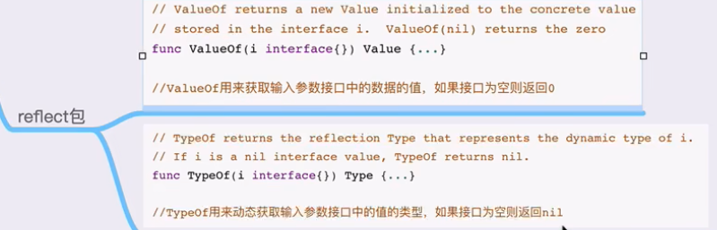

  
在 Go 语言的 `reflect` 包中，`ValueOf` 和 `TypeOf` 是两个非常重要的函数，它们提供了检查变量的运行时类型和值的功能。这使得 Go 能够在运行时进行动态类型检查和操作，是反射的核心功能之一。

### `reflect.TypeOf`

`reflect.TypeOf` 接受任何 `interface{}` 类型的值作为参数，并返回一个 `reflect.Type` 对象，该对象代表输入值的确切类型。通过这个返回的 `Type` 对象，你可以查询很多关于类型的信息，比如类型的名称、是否是原生类型、其种类（如结构体、指针、切片等），以及其他许多类型特有的属性。

**示例代码**:

```go
package main

import (
    "fmt"
    "reflect"
)

type MyStruct struct {
    Field int
}

func main() {
    x := 42
    y := MyStruct{Field: 123}

    fmt.Println("Type of x:", reflect.TypeOf(x))
    fmt.Println("Type of y:", reflect.TypeOf(y))
}
```

这段代码将输出变量 `x` 和 `y` 的类型，即 `int` 和 `main.MyStruct`。

### `reflect.ValueOf`

`reflect.ValueOf` 函数也接受任何 `interface{}` 类型的值，并返回一个 `reflect.Value` 对象，该对象持有原始的值信息。通过这个返回的 `Value` 对象，你可以进行很多操作，如读取值、修改值（如果可修改）、调用关联的方法等。`reflect.Value` 提供了接口到具体值的动态访问，是反射操作中的另一个核心功能。

**示例代码**:

```go
package main

import (
    "fmt"
    "reflect"
)

type MyStruct struct {
    Field int
}

func main() {
    y := MyStruct{Field: 123}

    value := reflect.ValueOf(y)
    fmt.Println("Value of y.Field:", value.FieldByName("Field").Int())
}
```

这段代码展示了如何使用 `reflect.ValueOf` 来访问 `y` 中的 `Field` 字段的值。

### 可用性和实用操作

通过 `reflect.TypeOf` 和 `reflect.ValueOf`，你可以在运行时对类型和值进行各种检查和操作。这两个功能在需要编写通用函数或处理未知类型数据时特别有用，例如在编写序列化库、ORM、或其他需要大量反射的库时。

然而，使用反射应当谨慎，因为反射相较于直接的静态类型访问通常具有更低的性能，并且代码的可读性和可维护性可能会降低。正确的使用场景是你不能直接通过静态类型来完成任务时。