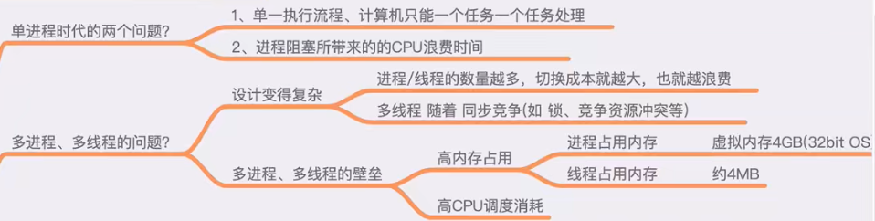
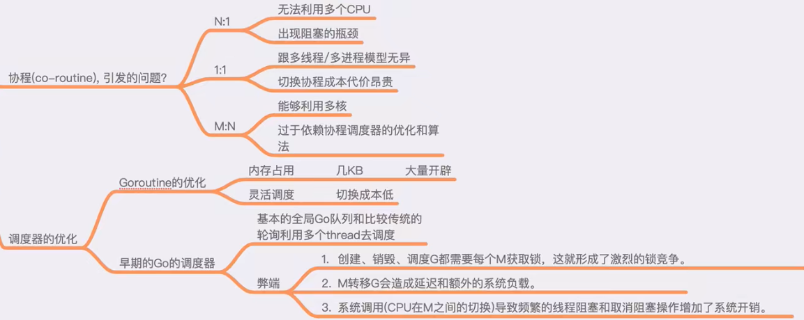
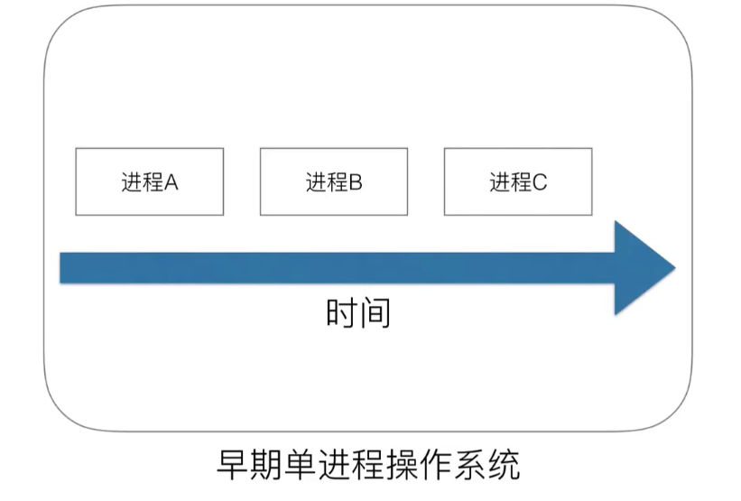
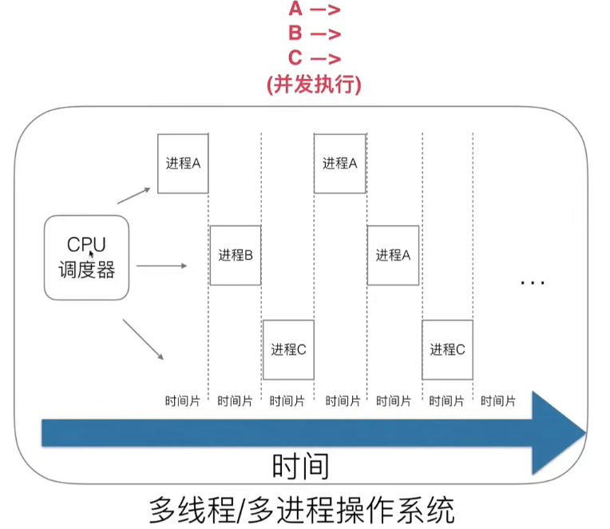
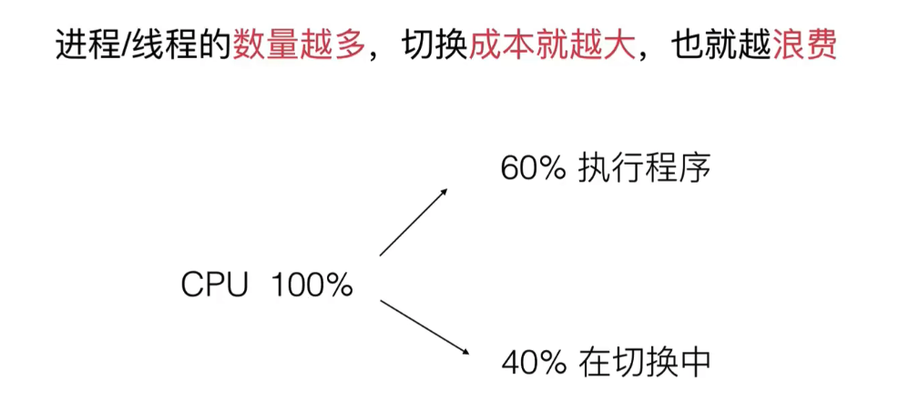
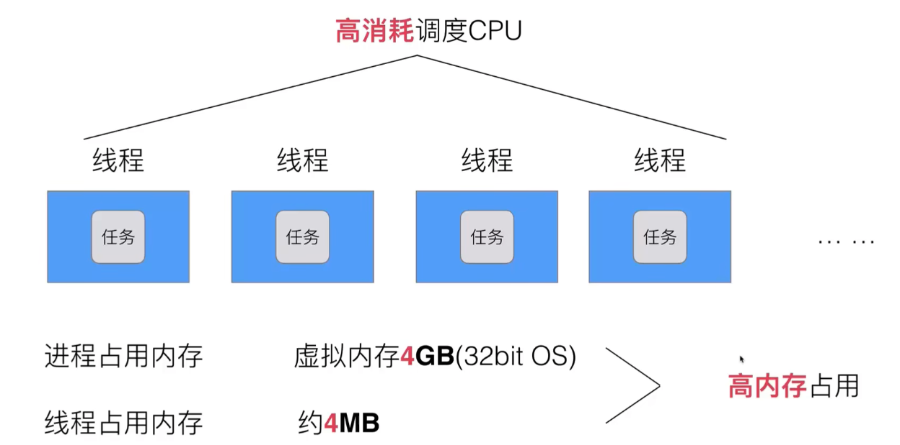
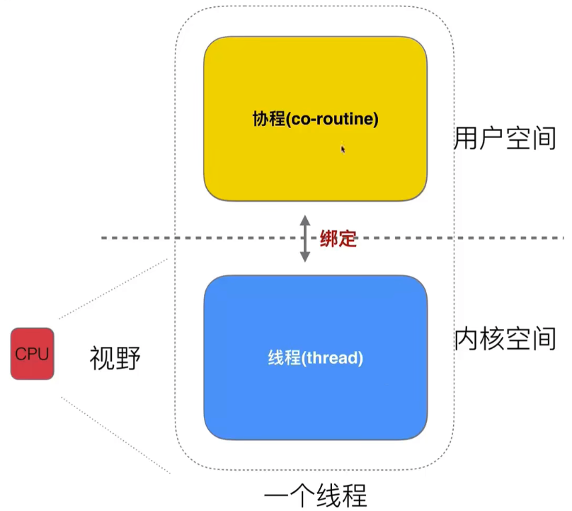

进程和线程 & 并发和并行 的区别：https://chatgpt.com/share/66eaa33f-be58-8013-8ea1-498d142b6183

## Golang调度器的由来：
https://www.yuque.com/aceld/golang/srxd6d  

 
## 早期单进程操作系统
  
每个进程顺序进行执行，也可以是线程（因为cpu不区分进程和线程）。  

## 多线程/多进程操作系统
cpu有一个轮训调度器，做一个时间片的切分，规定了一个时间宽度，那么一个进程的执行时间就不能超过这个时间片，如果超过，就强制切换进程；等轮训一圈之后，再回到A。从宏观上看，是三个进程一起执行（并发），但实际是cpu在同一时间只执行一个进程。  
  
优点：多进程/多线程解决了阻塞问题。  
  
但是又有新的问题：切换进程（线程）时，是有切换成本的（cpu从一个进程切换到下一个进程需要保持当前进程的一些状态，中间会有很多上下文的切换，就会有拷贝和复制）  
  
同时设计也变得复杂：多线程 伴随 同步竞争（如 锁、竞争资源冲突等）  
  

## 协程
一个线程可以分为用户态和内核态，内核态表示操作系统底层，包括进程开辟、分配资源等；用户态是上层写业务逻辑的、调接口的，能否将这两个空间切分为用户线程和内核线程？如果切换成功，那么就可以让用户线程和内核线程做一个绑定，内核线程就单独整理硬件的东西，用户线程就保证业务层面的效果。cpu的视野只能看到内核，所以cpu本身对这种切分行为是无感的，那么操作系统层面是不需要改任何代码的，只需要在用户线程中改代码就可以了。此时成用户线程成为协程，  
  

