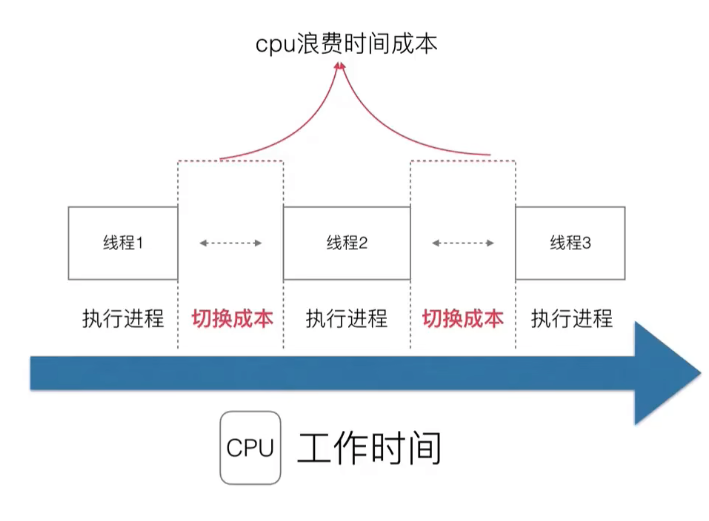
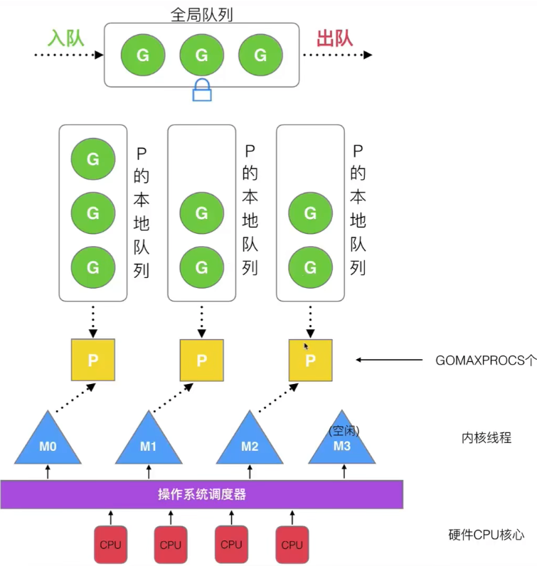

进程和线程 & 并发和并行 的区别：https://chatgpt.com/share/66eaa33f-be58-8013-8ea1-498d142b6183

## Golang调度器的由来：
https://www.yuque.com/aceld/golang/srxd6d  

 
## 早期单进程操作系统
  
每个进程顺序进行执行，也可以是线程（因为cpu不区分进程和线程）。  

## 多线程/多进程操作系统
cpu有一个轮询调度器，做一个时间片的切分，规定了一个时间宽度，那么一个进程的执行时间就不能超过这个时间片，如果超过，就强制切换进程；等轮训一圈之后，再回到A。从宏观上看，是三个进程一起执行（并发），但实际是cpu在同一时间只执行一个进程。  
  
优点：多进程/多线程解决了阻塞问题。  
  
但是又有新的问题：切换进程（线程）时，是有切换成本的（cpu从一个进程切换到下一个进程需要保持当前进程的一些状态，中间会有很多上下文的切换，就会有拷贝和复制）  
  
同时设计也变得复杂：多线程 伴随 同步竞争（如 锁、竞争资源冲突等）  
  

## 协程
一个线程可以分为用户态和内核态，内核态表示操作系统底层，包括进程开辟、分配资源等；用户态是上层写业务逻辑的、调接口的，能否将这两个空间切分为用户线程和内核线程？如果切换成功，那么就可以让用户线程和内核线程做一个绑定，内核线程就单独整理硬件的东西，用户线程就保证业务层面的效果。cpu的视野只能看到内核，所以cpu本身对这种切分行为是无感的，那么操作系统层面是不需要改任何代码的，只需要在用户线程中改代码就可以了。此时成用户线程称为协程(co-routine)，内核线程称为线程(thread)。  
  
绑定时，将一个内核线程(thread)通过一个协程调度器（轮询）绑定多个协程(co-routine)，这样cpu还是无感，同时让每个协程都挂载了一个任务，这样用户态依然能够保证一个并发的效果，同时cpu不需要切换了。这种模式称为n:1的协程对应关系。
  
这里有一个问题，当一个协程阻塞了，那么会影响下一个协程的调度。

如果改为1:1的协程对应关系，这里没有阻塞的问题了，但是和多线程/多进程一样。  
  

M:N的协程对应关系，协程调度器优化的越好（不同的编程语言就需要做它们自己的协程调度器），那么性能越好。  
  

## golang对协程的处理
golang在对调度器处理之前，先将协程(co-routine)改为Goroutine，将线程内存改为了几KB，那么就可以灵活调度，可以常切换。

### 调度器
  

#### 早期
现在有N个线程，然后有一个协程队列（每有一个任务就放入到协程队列中），现在是m:n的对应关系。
  
当M0想要去执行G时，会先去队列中获取锁，然后执行一个Goroutine，剩余没有执行的Goroutine就会往前挪；执行结束后，将会还锁。

缺点：
- 创建、销毁、调度 G 都需要每个 M 获取锁，这会导致激烈的锁竞争。这里的 M 和 G 可能是指系统中的某些资源或操作单元，当多个 M 同时需要获取锁来进行这些操作时，就会产生竞争。
- M 转移 G 会造成延迟和额外的系统负载。这意味着当 M 在转移 G 时，会使系统出现延迟，并且增加系统的负担。
- 系统调用（CPU 在 M 之间的切换）会导致频繁的线程阻塞和取消阻塞操作，增加了系统开销。

第二个缺点详细解释：
  
假设一个Goroutine在运行过程中创建了一个新的G'，那么为了保证并发，这个G'将会在M1执行，但是这就损失了局部性（即G和G'都在M0上执行）  

#### 优化 GMP
  
Processor是用来处理goroutine的，processor包含了每一个goroutine的资源，如果要运行goroutine，那么需要先获取p。

GMP模型：
- 最底层是硬件CPU核心层，是CPU的核心数；
- 操作系统内部调度器，用来调用CPU的；
- 内核线程；
- 用户态：每个内核线程上都有一个p，p保存每一个真正的进程（每个程序全部的goroutine的资源(如栈、堆等数据)）；可以通过GOMAXPROCS来设置p的个数，一个p同一时间只能运行一个G。
- 每个p上面都有一个p的本地队列，p就是负责将队列中的goroutine拿给m执行；那么同一时刻能够运行的G就是来有几个P(并行)=GOMAXPROCS
- 全局队列：当有G时，优先放入p中，但是没有空闲的p时，就放在全局队列中
  

### 调度器的设计策略
- 复用线程
    - work stealing机制  
      
    在途中，M1在处理G1，而P1后面还有两个G，同时M2是空闲状态；此时M2就从M1中偷取一个G3  
    - hand off机制  
      
    此时M1在执行的G1阻塞了，此时cpu就在等待中；那么就创建/唤醒一个线程M3，P1和M3进行绑定；同时此时的M1在睡眠，当G1阻塞结束后，如果还需要继续执行，会加入到其他队列中，M1要么睡眠要么销毁。  
- 利用并行：通过GOMAXPROCS来限定P的个数 = cpu核数/2
- 抢占  
      
    - 以前的co-routine：只有当co-routine主动释放cpu，那么别的co-routine才能使用  
    - goroutine：每个G最多运行10ms，到了10ms新的G直接抢占cpu  
- 全局G队列
    - 全局队列有入队和出队，同时还有一个锁的保护
    - 和work stealing机制类似，当M2没有G运行时，它会先去M1那里偷，如果M1也没有，那么会去全局队列偷，但是这里有一个获取锁和解锁的过程，会慢一点。

