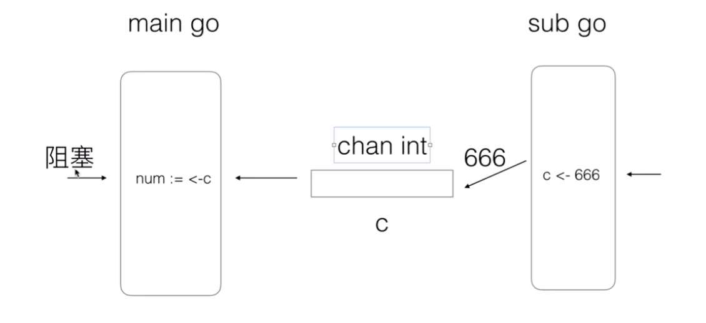

## test_no_channel.go

在`test_no_channel.go`中，如果没有最后一行，那么打印结果是：main goroutine 结束...  
这是因为`main` 函数在启动子 goroutine 后立即结束，导致程序在子 goroutine 有机会执行之前就已经退出了。Go 程序的主 goroutine（即 `main` 函数）结束时，整个程序会终止，而不等待其他 goroutine 完成。因此，子 goroutine 中的代码可能根本没有机会运行。

## test1_channel.go

而在`test1_channel.go`中，不管运行多少次，都是这个结果：

```sh
子-goroutine开始...
子-goroutine结束
num =  666
main goroutine 结束...
```

## `main.go` 比 `sub.go` 快

### 1

首先 `main.go` 和 `sub.go` 是异步的，所以按理说，`main.go` 是不会等 `sub.go` 的.
比如现在是 `main.go` 运行到了 `num := <- c`，而此时的 `sub.go` 还没有给值传递给 `c`。  


### 2

那么此时 `main.go` 就会阻塞。然后 `sub.go` 运行到了 `c <- 666`，将 666 写到管道中。  


### 3

管道就会唤起 `main.go` ，然后 `main.go` 就正常的往下执行。  


## `sub.go` 比 `main.go` 快

### 1

因为这次创建的管道是无缓冲的，而此时 `main.go` 还没有来取管道里面的数据，那么此时 `sub.go` 会发生阻塞。  


### 2

只有当 `main.go` 来取数据时，阻塞才消失。  

