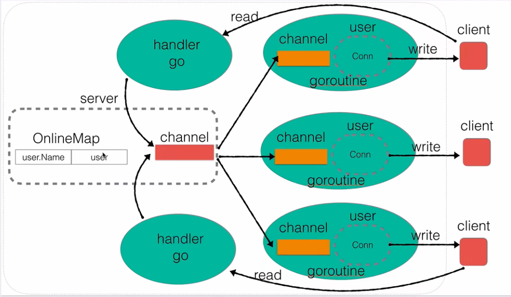

## 架构图

  
架构图中主要包含了两种类型：`server`（服务器）和`user`（在线用户）。

- `server`

  - `server`中的`OnlineMap`主要记录当前有哪些用户在线：`key: user.Name, value: user`，当需要私聊用户时，需要找到用户的地址
  - `server`中的`channel`是用来广播的；当有一个消息传入到此`channel`中，它会发给某个客户端的`channel`

- `user`
  - 写：第一个`goroutine`会一直阻塞的从`channel`中读消息，如果有消息，会立刻给消息回写给客户端`client`
  - 读：第二个`goroutine`会一直阻塞的等待`client`发消息

## 版本迭代

1. 构建基础 server
2. 用户上线功能
3. 用户消息广播机制
4. 用户业务层封装
5. 在线用户查询
6. 修改用户名
7. 超时强踢功能
8. 私聊功能
9. 客户端实现
