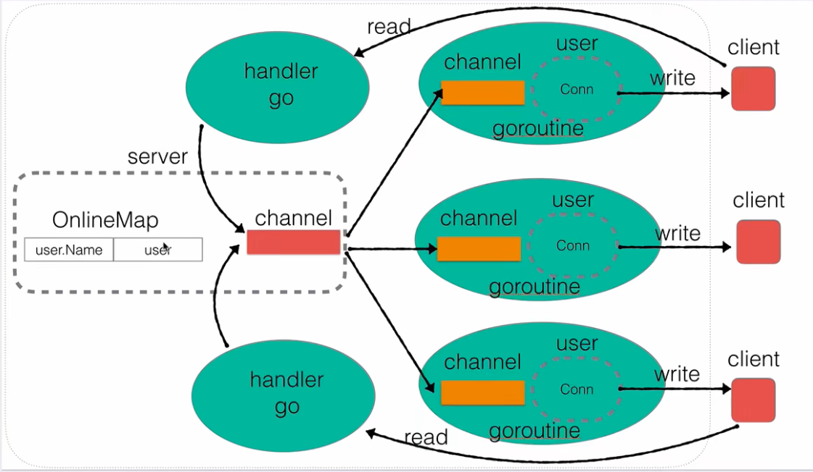

## 架构图

  
架构图中`SERVER`主要包含了两种类型：`server`（服务器）和`user`（在线用户）。虚线外面的是真实的`client`。

- `server`

  - `server`中的`OnlineMap`主要记录当前有哪些用户在线：`key: user.Name, value: user`，当需要私聊用户时，需要找到用户的地址
  - `server`中的`channel`是用来广播的；当有一个消息传入到此`channel`中，它会发给某个客户端的`channel`

- `user`
  - 写：第一个`goroutine`会一直阻塞的从`channel`中读消息，如果有消息，会立刻给消息回写给客户端`client`
  - 读：第二个`goroutine`会一直阻塞的等待`client`发消息

## 版本迭代

0. socket: <a href = "./readme/socket.md">socket</a>
1. 构建基础 server: <a href = "./readme/v1.server.readme.md">v1.server</a>
2. 用户上线功能: <a href = "./readme/v2.user.readme.md">v2.user</a>
3. 用户消息广播机制: <a href = "./readme/v3.user_message_broadcast.readme.md">v3.user message broadcast</a>
4. 用户业务层封装: <a href = "./readme/v4.user_service_encapsulation.readme.md">v4.user service encapsulation</a>
5. 在线用户查询: <a href = "./readme/v5.online_user_search.readme.md">v5.online user search</a>
6. 修改用户名: <a href = "./readme/v6.user_rename.readme.md">v6.user rename</a>
7. 超时强踢功能: <a href = "./readme/v7.user_overtime_kick.readme.md">v7.user overtime kick</a>
8. 私聊功能: <a href = "./readme/v8.user_private_chat.readme.md">v8.user private chat</a>
9. 客户端实现:
   - <a href = "./readme/v9_2.command_line_parse.readme.md">v9_2.command line parse</a>
   - <a href = "./readme/v9_4.client_rename.readme.md">v9_4.client rename</a>
   - <a href = "./readme/v9_6.client_public_chat.readme.md">v9_6.client public chat</a>
   - <a href = "./readme/v9_7.client_terminal_exit.readme.md">v9_7.client terminal exit</a>
10. model 管理错误:

- <a href = "./readme/v10.server_go_error.readme.md">v10.server go model error</a>
