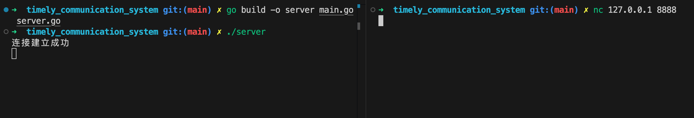

## start

一般服务器的启动可以分为以下三个基本步骤，尤其是在涉及网络服务的情况下：

1. **监听端口（Listening）**：
   服务器首先需要在一个指定的网络地址（IP）和端口上监听来自客户端的连接请求。这是通过创建一个监听套接字（listener socket）完成的，它会不断检查是否有新的连接请求。

2. **接受连接（Accepting Connections）**：
   一旦服务器端口上有连接请求，监听套接字就需要接受这个请求，建立与客户端的连接。在这个过程中，通常会创建一个新的套接字专门用于与该客户端的通信。在多线程或使用 goroutines 的服务器中，每个连接通常会在它自己的线程或协程中处理，这样可以同时处理多个客户端连接。

3. **处理连接（Handling Connections）**：
   与客户端的连接一旦建立，服务器就需要根据具体的应用逻辑来处理来自客户端的数据请求。这可能包括读取数据、处理数据、发送响应等操作。处理完毕后，根据需要可能会关闭连接，或者保持连接等待更多的数据交换。

我们可以通过一个简单的聊天服务器的例子来形象地说明服务器启动和运行的过程。这个聊天服务器将能够接受多个客户端的连接，允许他们发送和接收消息。以下是用 Go 语言实现的基本步骤：

### 第一步：监听端口

服务器首先在一个指定的 IP 地址和端口上启动监听。这是聊天服务器开始接受连接请求的地方。

```go
listener, err := net.Listen("tcp", "localhost:8080")
if err != nil {
    log.Fatalf("Failed to listen on localhost:8080: %v", err)
}
defer listener.Close()
fmt.Println("Server is listening on localhost:8080")
```

### 第二步：接受连接

服务器循环接受来自客户端的连接请求。对于每个连接，服务器通常会启动一个新的 goroutine（轻量级线程），这样可以同时处理多个连接，每个连接独立处理。

```go
for {
    conn, err := listener.Accept()
    if err != nil {
        fmt.Println("Error accepting connection:", err)
        continue
    }
    go handleConnection(conn) // 处理连接的goroutine
}
```

### 第三步：处理连接

在这个例子中，每个连接都由`handleConnection`函数处理，这个函数读取客户端发送的消息，简单地回显（echo）回去，然后关闭连接。

```go
func handleConnection(conn net.Conn) {
    defer conn.Close() // 确保在函数返回时关闭连接

    // 读取客户端发送的消息
    buffer := make([]byte, 1024)
    len, err := conn.Read(buffer)
    if err != nil {
        fmt.Println("Error reading:", err)
        return
    }
    fmt.Printf("Received: %s\n", string(buffer[:len]))

    // 发送回显消息
    _, err = conn.Write(buffer[:len])
    if err != nil {
        fmt.Println("Error writing:", err)
        return
    }
    fmt.Println("Message echoed")
}
```

## 启动

- `go build -o server main.go server.go`
- `./server`
- 创建新的终端
- `nc 127.0.0.1 8888`
  
