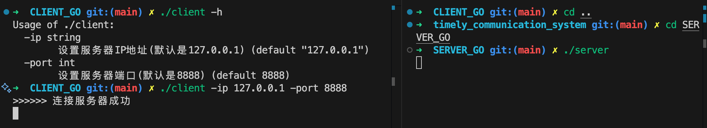

### Go 语言 `flag` 包详解及代码示例分析

在 Go 语言中，`flag` 包用于解析命令行参数，允许开发者轻松地定义和使用命令行标志（flags）。本文将详细讲解你提供的代码中与 `flag` 包相关的部分，帮助你理解其作用和使用方法。

#### 1. `flag` 包简介

`flag` 包是 Go 标准库的一部分，用于解析命令行参数。它支持定义不同类型的标志，如字符串、整数、布尔值等，并自动生成帮助信息。当程序运行时，`flag` 包会解析传入的命令行参数，并将其赋值给预先定义的变量。

常见的使用步骤包括：

1. 定义标志变量。
2. 调用 `flag.Parse()` 解析命令行参数。
3. 使用解析后的标志值。

#### 2. 代码中 `flag` 的使用

让我们逐步分析你提供的代码中与 `flag` 包相关的部分。

```go
var serverIp  string
var serverPort int

func init() {
    flag.StringVar(&serverIp, "ip", "127.0.0.1", "设置服务器IP地址(默认是127.0.0.1)")
    flag.IntVar(&serverPort, "port", 8888, "设置服务器端口(默认是8888)")
}
```

##### 2.1 全局变量声明

```go
var serverIp  string
var serverPort int
```

这里声明了两个全局变量 `serverIp` 和 `serverPort`，分别用于存储服务器的 IP 地址和端口号。这两个变量将在后续通过命令行参数进行赋值。

##### 2.2 `init` 函数中的标志定义

```go
func init() {
    flag.StringVar(&serverIp, "ip", "127.0.0.1", "设置服务器IP地址(默认是127.0.0.1)")
    flag.IntVar(&serverPort, "port", 8888, "设置服务器端口(默认是8888)")
}
```

`init` 函数是 Go 程序中的一个特殊函数，会在 `main` 函数执行前自动调用。这里在 `init` 函数中使用了 `flag` 包的两个函数来定义命令行标志：

1. **`flag.StringVar`**

   ```go
   flag.StringVar(&serverIp, "ip", "127.0.0.1", "设置服务器IP地址(默认是127.0.0.1)")
   ```

   - **作用**：定义一个字符串类型的命令行标志。
   - **参数说明**：
     - `&serverIp`：指向存储标志值的变量的指针。
     - `"ip"`：标志的名称，用户在命令行中通过 `-ip` 指定。
     - `"127.0.0.1"`：标志的默认值。
     - `"设置服务器IP地址(默认是127.0.0.1)"`：标志的描述信息，用于生成帮助信息。

2. **`flag.IntVar`**

   ```go
   flag.IntVar(&serverPort, "port", 8888, "设置服务器端口(默认是8888)")
   ```

   - **作用**：定义一个整数类型的命令行标志。
   - **参数说明**：
     - `&serverPort`：指向存储标志值的变量的指针。
     - `"port"`：标志的名称，用户在命令行中通过 `-port` 指定。
     - `8888`：标志的默认值。
     - `"设置服务器端口(默认是8888)"`：标志的描述信息，用于生成帮助信息。

##### 2.3 标志解析

调用 `flag.Parse()` 解析命令行参数。`flag.Parse()` 函数会根据命令行输入的参数值来更新之前定义的标志变量。如果不调用 `flag.Parse()`，标志变量将保持其默认值，无法获取用户通过命令行传入的参数。

通常，`flag.Parse()` 应该在 `main` 函数的开始部分调用。例如：

```go
func main() {
    flag.Parse() // 解析命令行参数

    client := NewClient(serverIp, serverPort)
    if client == nil {
        fmt.Println(">>>>>> 连接服务器失败")
        return
    }

    fmt.Println(">>>>>> 连接服务器成功")

    // select {} // 阻塞

    for {
        time.Sleep(1 * time.Second)
    }
}
```

##### 2.4 完整的标志使用流程

总结一下完整的 `flag` 使用流程：

1. **定义标志变量**：通过 `flag.StringVar`、`flag.IntVar` 等函数将命令行标志与变量关联。
2. **解析标志**：在 `main` 函数中调用 `flag.Parse()` 以解析传入的命令行参数。
3. **使用标志值**：解析后，定义的变量将包含用户输入的值，可以在程序中使用这些值。

#### 3. 运行程序并传递命令行参数

假设你的程序编译为 `client`，可以通过以下方式运行并传递自定义的服务器 IP 和端口：

```bash
./client -ip=192.168.1.100 -port=9090
```

如果不传递这些参数，程序将使用在 `flag.StringVar` 和 `flag.IntVar` 中定义的默认值，即 `127.0.0.1` 和 `8888`。

**示例：**

```bash
$ ./client
>>>>>> 连接服务器成功
```

```bash
$ ./client -ip=192.168.1.100 -port=9090
>>>>>> 连接服务器成功
```

#### 演示


