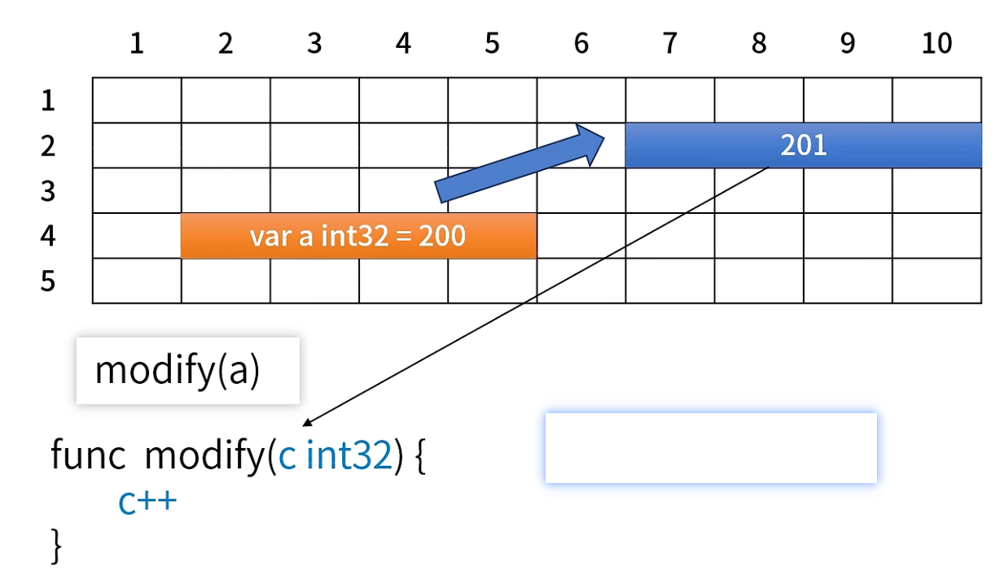
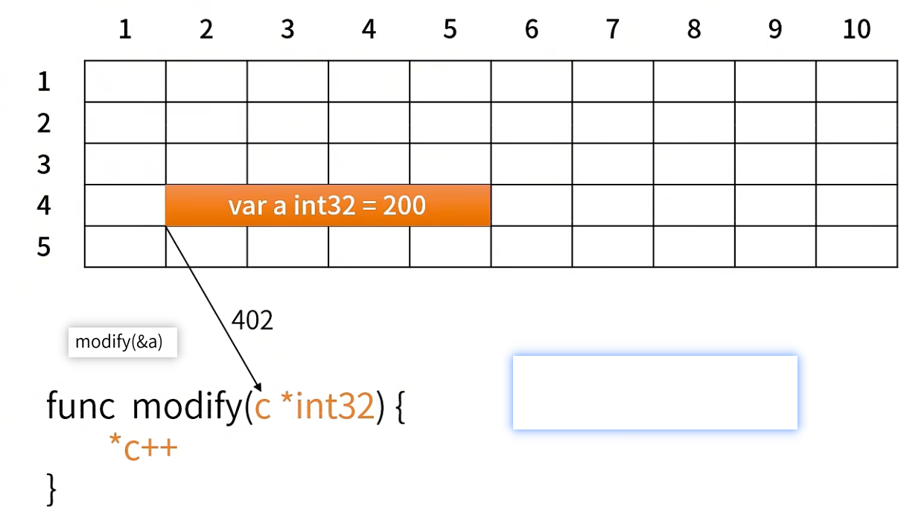
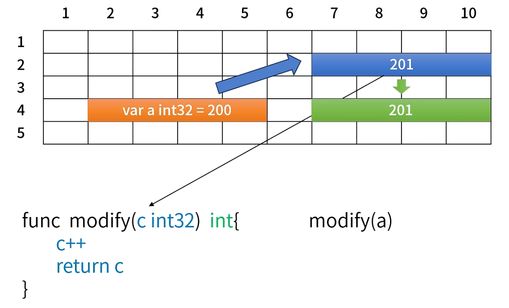
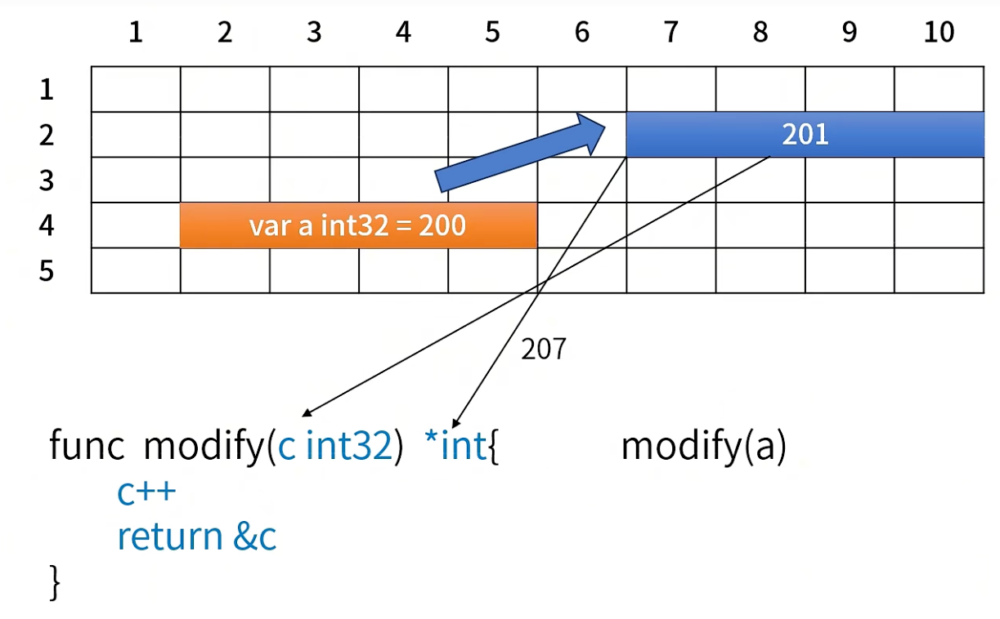
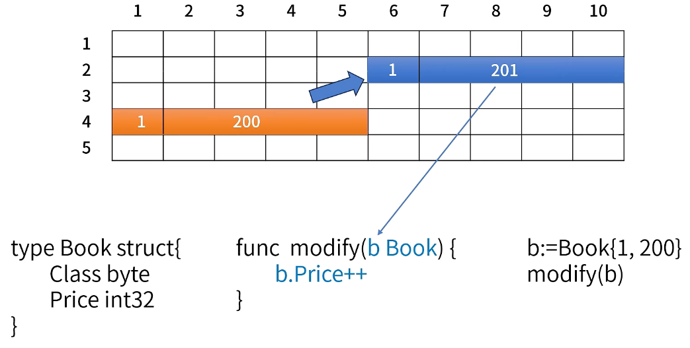
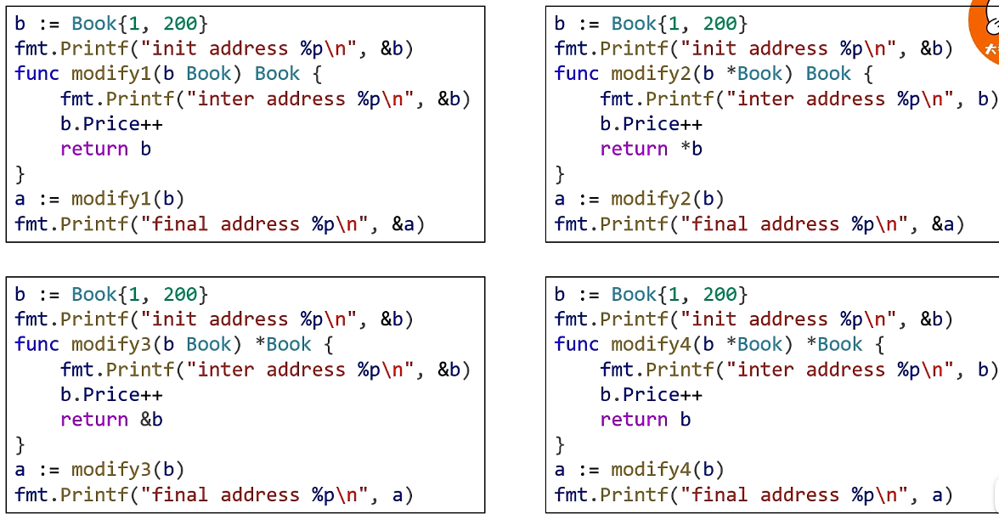
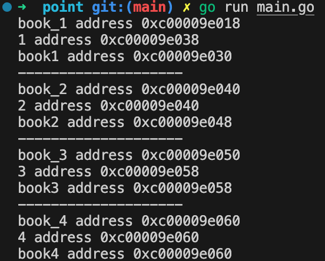
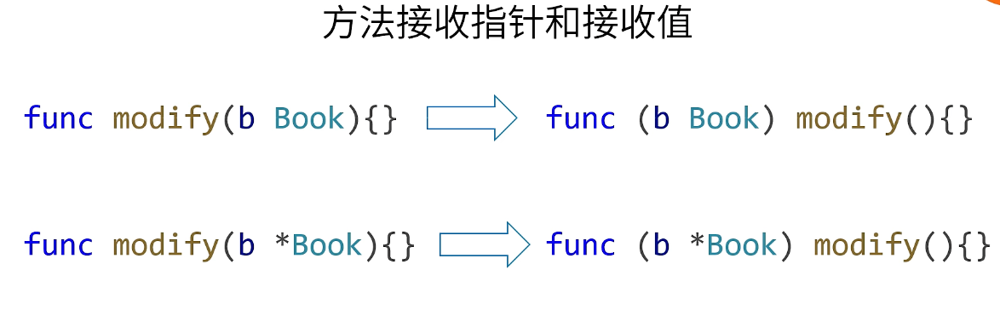
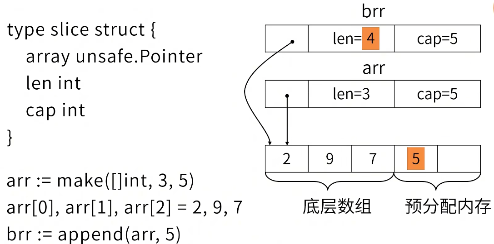
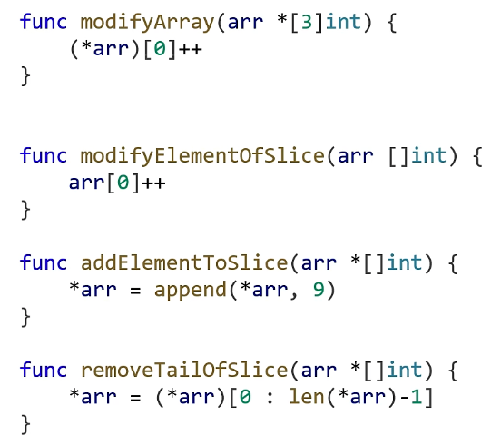

## 1. 指针的本质
内存可以比作一个一个表格，指针就上来操作内存的。
现在假设每个格子`1Byte`(`1Byte = 8bits`)。
变量的地址指的是那个首地址。

虽然`bool`只需要`1bit`，但是在任何语言中，最小的数据类型也需要占一个字节，指针本质上就是地址，地址本质上就是一个数字。

## 2. 指针的基本操作
通过指针可以修改它指向的内容的数据。但是能否通过`p1`来修改`b`的数据呢？
在`c++`中是可以的，但是在`go`中是不可以的。因为在`c`语言中，指针是可以进行运算的，如：`++、+4`等；但是在`go`中指针是没有运算的，所以`go`语言是内存安全的语言。

## 3. 函数何时传指针，何时返回指针
### 入参

传递参数给函数时，是先对参数的值发生拷贝的，函数是对那个备份来执行访问和修改的。



传递参数的引用给函数时，是对参数的地址号进行拷贝，函数操作地址号对应的内存里的数据。

### 出参

值传递的情况下，出参还是会发生拷贝的。
1) **入参拷贝**：当调用 `b := modify(a)` 时，`a` 的值会被拷贝到函数参数 `c` 中。这意味着 `c` 是 `a` 的一个副本，修改 `c` 不会影响 `a` 的值。
2) **出参拷贝**：在函数内部，`c++` 使得 `c` 的值增加，但这个增加的值仍然是在 `c` 的副本上。最后，`return c` 会将 `c` 的值拷贝到返回值。这次拷贝的结果会被赋值给 `b`。所以，`b` 得到的是 `c` 的拷贝，而不是 `c` 本身。

因此，整个过程中，`a`、`c` 和 `b` 都是独立的值，互不影响。没有“中间地址”的概念，返回的值直接拷贝给 `b`。最终的结果是，`b` 拥有 `c` 修改后的值，而 `a` 保持不变。


```go
func modify(c int32) *int32 {
	c++
	return &c
}

func main() {
	var a int32 = 1
	b := modify(a)
	fmt.Println("b = ", *b)
}
```
在 Go 语言中，局部变量的地址在函数返回后并不立即失效，尤其是在你访问它的那一刻。如果在函数返回之前你访问了这个地址，它的值是可以读取的。但这并不意味着这种做法是安全或推荐的，原因如下：
- 局部变量的生命周期：在 `modify` 函数中，`c` 是一个局部变量。尽管你在函数内部访问了 `&c`，这个地址在函数返回之前是有效的。然而，一旦函数返回，`c` 变量的内存可以被操作系统回收或被其他栈帧覆盖。
- 内存可用性：在你调用 `fmt.Println("b = ", *b)` 时，可能恰好 `c` 的内存空间尚未被其他操作覆盖，所以你能得到 `2` 的值。这是因为在短时间内，操作系统没有做其他的内存操作。
- 未定义行为的风险：虽然在这个特定情况下你能看到结果，但这实际上是非常危险的做法。程序可能在某些情况下崩溃，或者在不同的环境或运行条件下，`b` 的值可能会不同，甚至可能导致访问违规（segmentation fault）。

#### 第二个代码块

```go
func modify(c int32) *int32 {
	c++ // 修改副本
	result := new(int32) // 在堆上分配内存
	*result = c // 将修改后的值赋给堆中的地址
	return &result // 返回的是 result 的地址
}
```

**问题分析：**
1. **返回地址无效**：在这里，返回 `&result` 会返回 `result` 变量的地址，而不是堆上分配的内存地址。`result` 是局部变量，其生命周期在函数结束时结束，因此返回的指针将无效。

#### 修正后的代码

```go
func modify(c int32) *int32 {
	c++ // 修改副本
	result := new(int32) // 在堆上分配内存
	*result = c // 将修改后的值赋给堆中的地址
	return result // 返回 result 指向的内存地址
}

func main() {
	var a int32 = 1
	b := modify(a)
	fmt.Println(*b) // 输出修改后的值
}
```
1) **内存分配**：`new(int32)` 在堆上分配了一块内存，用于存储一个 `int32` 类型的数据。这个内存的地址被保存到变量 `result` 中，因此 `result` 是一个指向 `int32` 的指针。
2) **访问数据**：使用 `*result` 可以访问这块内存中的值。当你执行 `*result = c` 时，你实际上是在给这块内存赋值，将 `c` 的修改值存储进去。
3) **返回值问题**：当你使用 `return &result` 时，返回的是 `result` 这个局部变量的地址（即指向 `result` 的指针）。由于 `result` 是局部变量，当函数结束时它的生命周期也结束，所以返回的地址将无效。
4) **正确的返回方式**：正确的做法是直接返回 `result`，这样你返回的是堆上分配的内存地址。这块内存在函数结束后仍然存在，调用者可以安全地访问和使用这块内存。

## 4. 结构体的方法何时接受指针
  
这里传的是结构体的值，函数修改的是新拷贝结构体的数据。

  
但是大部分情况下是想修改原来的结构体，这里需要传递指针。

### 练习
  


### 方法接受指针和接收值
  
左边和右边几乎等价，但是左边的modify是普通函数，右边是从属于结构体的成员方法。

坑：
- `func modify(b Book){}` 和 `func (b Book) modify(){}`:值实现了这个接口，则指针默认也实现了接口。
- `func modify(b *Book){}` 和 `func (b *Book) modify(){}`: 反之不成立。

#### 接口——值实现了接口，指针也默认实现接口

- **值接收者** (`func modify(b Book) {}`):
  - 当一个类型 `Book` 实现了某个接口的所有方法时，`Book` 类型的值被认为实现了这个接口。
  - 由于指针 `*Book` 是 `Book` 类型的一个引用，因此如果 `Book` 类型实现了接口，则 `*Book` 也会默认实现该接口。
  
例如：

```go
type Book struct {
    Title string
}

type Modifier interface {
    modify()
}

// Book 类型实现了 modify 方法
func (b Book) modify() {
    // 实现逻辑
}

// 因为 Book 实现了 Modifier 接口，所以 *Book 也默认实现了 Modifier 接口
var b Book
var pb *Book = &b
var mod Modifier = pb // 这是合法的
```

#### 接口——指针接收者和方法接收者的反向情况

- **指针接收者** (`func modify(b *Book) {}`):
  - 如果方法接收者是指针类型 `*Book`，那么只有 `*Book` 的实例才能调用这个方法。
  - 这意味着 `Book` 类型的值并不能直接调用这个方法，也就是说，`Book` 不会被视为实现了该接口。

例如：

```go
// Book 类型实现了指针接收者的 modify 方法
func (b *Book) modify() {
    // 实现逻辑
}

var b Book
var pb *Book = &b

// 不能将 Book 直接作为 Modifier 接口，因为方法接收者是 *Book
// var mod Modifier = b // 这是不合法的
```

#### 方法——值接收者与指针接收者的调用

1. **值接收者的情况** (`func (b Book) modify() {}`):
   - 当方法的接收者是值类型（如 `Book`），无论是 `Book` 的值还是 `*Book` 的指针都可以调用这个方法。
   - 当你用 `pb *Book` 调用 `modify` 方法时，Go 会自动解引用这个指针，调用的是 `b Book` 的值接收者方法。

   示例代码：

   ```go
   type Book struct {
       Title string
   }

   // 值接收者方法
   func (b Book) modify() {
       // 实现逻辑
   }

   func main() {
       b := Book{Title: "Go Programming"}
       b.modify() // 直接调用

       pb := &b
       pb.modify() // 通过指针调用，自动解引用
   }
   ```

   在这种情况下，`b` 和 `pb` 都可以调用 `modify` 方法。

2. **指针接收者的情况** (`func (b *Book) modify() {}`):
   - 当方法的接收者是指针类型（如 `*Book`），只有 `*Book` 的指针可以调用这个方法。
   - 此时，`Book` 的值无法调用这个方法，因为它不包含指向原始值的指针。

   示例代码：

   ```go
   // 指针接收者方法
   func (b *Book) modify() {
       // 实现逻辑
   }

   func main() {
       b := Book{Title: "Go Programming"}
       // b.modify() // 这将导致编译错误，因为方法接收者是 *Book

       pb := &b
       pb.modify() // 通过指针调用，这是合法的
   }
   ```

- **值接收者**：`b Book` 和 `pb *Book` 都可以调用。
- **指针接收者**：只有 `pb *Book` 可以调用，`b Book` 不能直接调用。

## 5. 何时需要给函数传切片的指针
（`[]int`方括号里面不写数字则是切片，写数字是数组）  

  
虽然这里改变了底层数组里的数据，但是切片结构体`arr`的任何一个数据都没有改，所以这里切片`arr`是访问不到第四个元素5的。
`append`返回的元素是`brr`，这个`brr`是可以访问到第四个元素的。
由于`arr`和`brr`都是指向同一个底层数组的，所以`brr`如果修改了前三个元素，`arr`的元素也发生了变化。

### 练习
  
- 如果第一个函数的参数没有写`*`，那么其实传递的是数组的拷贝，则不会影响原始的数组。
- 第二个函数看上去是没有写`*`的，但是因为传递的是切片，那么其实拷贝的时候，也将切片这个结构体所有的数据都拷贝了，其中急包括了底层数组`array unsage.Pointer`，那么就和第一个函数一样，也达到了修改原始数组首元素的目的。
- 第三个函数传递了切片的指针，因为想要追加一个元素，`append`会将`len+1`，所以需要传递指针。

你提到的切片的结构体大致是正确的，但实际上 Go 语言中的切片是由编译器管理的，具体的实现细节可能会有所不同。让我们澄清一下切片的结构和行为。

#### 第四个函数

在 Go 语言中，切片的内部结构通常包含以下字段（虽然不一定是直接用 `struct` 表示）：

```go
type slice struct {
    array unsafe.Pointer // 指向底层数组的指针
    len   int            // 当前切片的长度
    cap   int            // 当前切片的容量
}
```

##### 切片切片表达式

当你使用切片表达式 `(*arr)[0:len(*arr)-1]` 时，实际上会创建一个新的切片结构，这个新切片的 `len` 字段会自动设置为 `len(*arr) - 1`，而 `cap` 字段则取决于底层数组的剩余部分。

##### 具体行为

1. **新切片的创建**：
   - `(*arr)[0:len(*arr)-1]` 创建了一个新的切片，它指向同一个底层数组，但只包含从 `0` 到 `len(*arr)-1` 的元素。
   - 新切片的 `len` 字段会变为 `len(*arr) - 1`，而 `cap` 字段依然可以访问底层数组的剩余部分，通常是 `cap(*arr)`。

2. **内存关系**：
   - 这个新切片并没有复制底层数组的数据，它只是创建了一个新的切片结构，该结构共享原底层数组的内存。
   - 原始切片的 `len` 和 `cap` 字段保持不变，但 `*arr` 被赋值为指向这个新切片。

##### 示例

```go
package main

import (
    "fmt"
    "unsafe"
)

func remove(arr *[]int) {
    *arr = (*arr)[0 : len(*arr)-1] // 创建一个新切片
}

func main() {
    arr := []int{1, 2, 3, 4, 5}
    fmt.Println("Before remove:", arr) // [1 2 3 4 5]
    fmt.Println("Length:", len(arr))    // 5
    fmt.Println("Capacity:", cap(arr))   // 5
    
    remove(&arr)
    
    fmt.Println("After remove:", arr)    // [1 2 3 4]
    fmt.Println("Length:", len(arr))      // 4
    fmt.Println("Capacity:", cap(arr))     // 5（假设底层数组仍然可用）
}
```

在这个例子中，调用 `remove` 后，切片的长度变为 `4`，而容量保持为 `5`，因为底层数组的长度仍然足够。新切片的 `len` 字段会自动减去 `1`。

##### 总结
- 使用切片表达式时，创建的新切片结构会自动设置其 `len` 字段。
- `cap` 字段通常是从原底层数组中获取的，指向的是原始切片的剩余部分。
- 新切片的创建不涉及底层数据的复制，只是更新了切片的视图。
- 底层数组的第五个元素仍然存在，只是新的切片无法访问它。


## 6. 如何在遍历slice/map的同时修改其中的元素