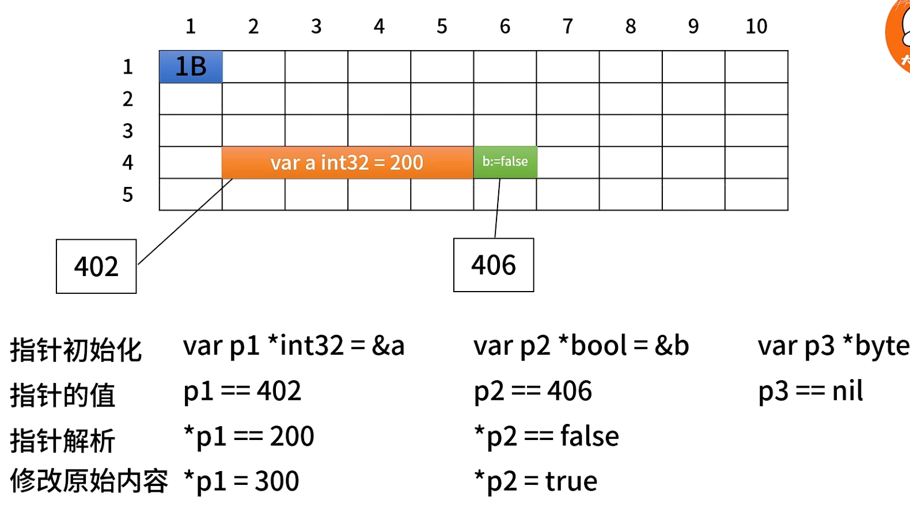
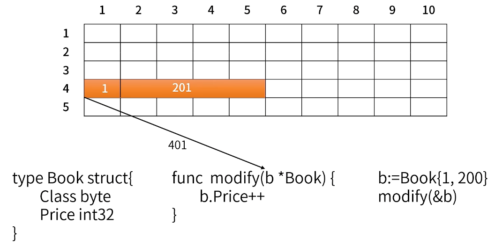

## 1. 指针的本质
内存可以比作一个一个表格，指针就上来操作内存的。
现在假设每个格子`1Byte`(`1Byte = 8bits`)。
变量的地址指的是那个首地址。

虽然`bool`只需要`1bit`，但是在任何语言中，最小的数据类型也需要占一个字节，指针本质上就是地址，地址本质上就是一个数字。

## 2. 指针的基本操作
通过指针可以修改它指向的内容的数据。但是能否通过`p1`来修改`b`的数据呢？
在`c++`中是可以的，但是在`go`中是不可以的。因为在`c`语言中，指针是可以进行运算的，如：`++、+4`等；但是在`go`中指针是没有运算的，所以`go`语言是内存安全的语言。

## 3. 函数何时传指针，何时返回指针
### 入参

传递参数给函数时，是先对参数的值发生拷贝的，函数是对那个备份来执行访问和修改的。


传递参数的引用给函数时，是对参数的地址号进行拷贝，函数操作地址号对应的内存里的数据。

### 出参

值传递的情况下，出参还是会发生拷贝的。
1) **入参拷贝**：当调用 `b := modify(a)` 时，`a` 的值会被拷贝到函数参数 `c` 中。这意味着 `c` 是 `a` 的一个副本，修改 `c` 不会影响 `a` 的值。
2) **出参拷贝**：在函数内部，`c++` 使得 `c` 的值增加，但这个增加的值仍然是在 `c` 的副本上。最后，`return c` 会将 `c` 的值拷贝到返回值。这次拷贝的结果会被赋值给 `b`。所以，`b` 得到的是 `c` 的拷贝，而不是 `c` 本身。

因此，整个过程中，`a`、`c` 和 `b` 都是独立的值，互不影响。没有“中间地址”的概念，返回的值直接拷贝给 `b`。最终的结果是，`b` 拥有 `c` 修改后的值，而 `a` 保持不变。


```go
func modify(c int32) *int32 {
	c++
	return &c
}

func main() {
	var a int32 = 1
	b := modify(a)
	fmt.Println("b = ", *b)
}
```
在 Go 语言中，局部变量的地址在函数返回后并不立即失效，尤其是在你访问它的那一刻。如果在函数返回之前你访问了这个地址，它的值是可以读取的。但这并不意味着这种做法是安全或推荐的，原因如下：
- 局部变量的生命周期：在 `modify` 函数中，`c` 是一个局部变量。尽管你在函数内部访问了 `&c`，这个地址在函数返回之前是有效的。然而，一旦函数返回，`c` 变量的内存可以被操作系统回收或被其他栈帧覆盖。
- 内存可用性：在你调用 `fmt.Println("b = ", *b)` 时，可能恰好 `c` 的内存空间尚未被其他操作覆盖，所以你能得到 `2` 的值。这是因为在短时间内，操作系统没有做其他的内存操作。
- 未定义行为的风险：虽然在这个特定情况下你能看到结果，但这实际上是非常危险的做法。程序可能在某些情况下崩溃，或者在不同的环境或运行条件下，`b` 的值可能会不同，甚至可能导致访问违规（segmentation fault）。

#### 第二个代码块

```go
func modify(c int32) *int32 {
	c++ // 修改副本
	result := new(int32) // 在堆上分配内存
	*result = c // 将修改后的值赋给堆中的地址
	return &result // 返回的是 result 的地址
}
```

**问题分析：**
1. **返回地址无效**：在这里，返回 `&result` 会返回 `result` 变量的地址，而不是堆上分配的内存地址。`result` 是局部变量，其生命周期在函数结束时结束，因此返回的指针将无效。

#### 修正后的代码

```go
func modify(c int32) *int32 {
	c++ // 修改副本
	result := new(int32) // 在堆上分配内存
	*result = c // 将修改后的值赋给堆中的地址
	return result // 返回 result 指向的内存地址
}

func main() {
	var a int32 = 1
	b := modify(a)
	fmt.Println(*b) // 输出修改后的值
}
```
1) **内存分配**：`new(int32)` 在堆上分配了一块内存，用于存储一个 `int32` 类型的数据。这个内存的地址被保存到变量 `result` 中，因此 `result` 是一个指向 `int32` 的指针。
2) **访问数据**：使用 `*result` 可以访问这块内存中的值。当你执行 `*result = c` 时，你实际上是在给这块内存赋值，将 `c` 的修改值存储进去。
3) **返回值问题**：当你使用 `return &result` 时，返回的是 `result` 这个局部变量的地址（即指向 `result` 的指针）。由于 `result` 是局部变量，当函数结束时它的生命周期也结束，所以返回的地址将无效。
4) **正确的返回方式**：正确的做法是直接返回 `result`，这样你返回的是堆上分配的内存地址。这块内存在函数结束后仍然存在，调用者可以安全地访问和使用这块内存。

## 4. 结构体的方法何时接受指针
  
这里传的是结构体的值，函数修改的是新拷贝结构体的数据。

  
但是大部分情况下是想修改原来的结构体，这里需要传递指针。

### 练习
  


### 方法接受指针和接收值
  
左边和右边几乎等价，但是左边的modify是普通函数，右边是从属于结构体的成员方法。

## 5. 何时需要给函数传切片的指针


## 6. 如何在遍历slice/map的同时修改其中的元素